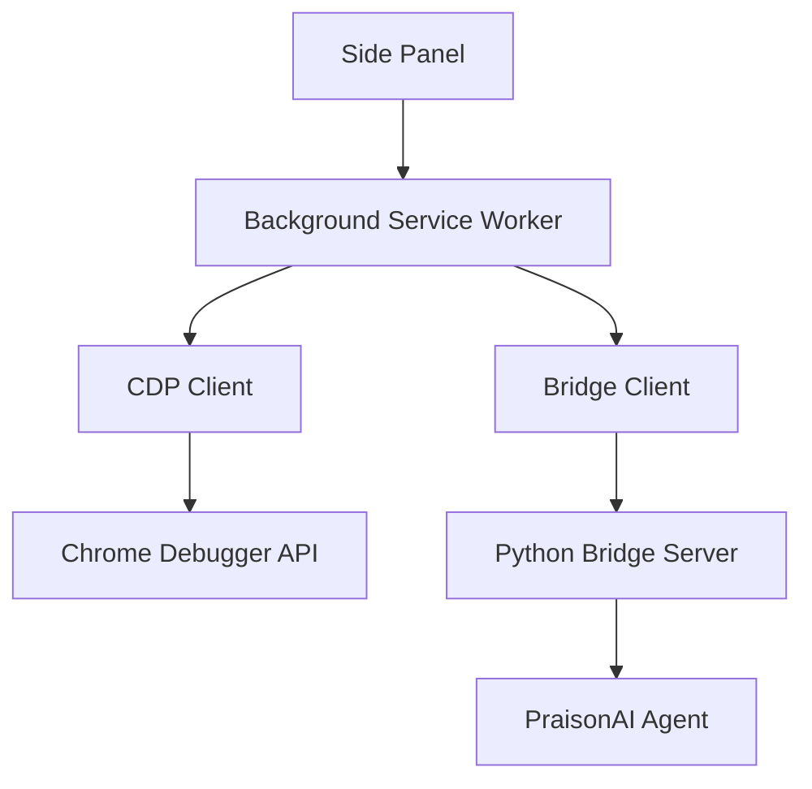

# Architecture Overview

```
src/
├── background/         # Service worker
│   └── index.ts       # Message routing, CDP sessions
├── cdp/               # Chrome DevTools Protocol
│   └── client.ts      # CDP client via chrome.debugger
├── bridge/            # Bridge client
│   └── client.ts      # WebSocket client to Python server
├── ai/                # AI integration
│   ├── builtin.ts     # Gemini Nano APIs
│   └── agent.ts       # Browser agent
├── content/           # Content script
│   └── index.ts       # DOM interaction
├── sidepanel/         # Side Panel UI
│   ├── sidepanel.html
│   ├── styles.css
│   └── index.ts
└── offscreen/         # Offscreen document
    └── index.ts       # Video recording, canvas ops
```

## Component Flow



## Key Components

### Background Service Worker
- Routes messages between components
- Manages CDP sessions per tab
- Handles bridge server connection

### CDP Client
- Attaches to tabs via `chrome.debugger`
- Executes actions via Chrome DevTools Protocol
- Captures page state and screenshots

### Bridge Client
- WebSocket connection to Python server
- Sends observations, receives actions
- Handles session lifecycle
